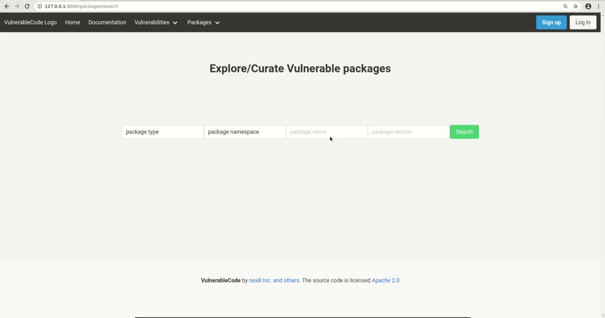

VulnerableCode
==============

|Build Status| |License| |Python 3.8| |stability-wip| |Gitter chat|

.. |Build Status| image:: https://github.com/nexB/vulnerablecode/workflows/CI/badge.svg
   :target: https://github.com/nexB/vulnerablecode/actions?query=workflow%3ACI
.. |License| image:: https://img.shields.io/badge/License-Apache%202.0-blue.svg
   :target: https://opensource.org/licenses/Apache-2.0
.. |Python 3.8| image:: https://img.shields.io/badge/python-3.8-blue.svg
   :target: https://www.python.org/downloads/release/python-380/
.. |stability-wip| image:: https://img.shields.io/badge/stability-work_in_progress-lightgrey.svg
.. |Gitter chat| image:: https://badges.gitter.im/gitterHQ/gitter.png
   :target: https://gitter.im/aboutcode-org/vulnerablecode

VulnerableCode is a free and open database of FOSS software package
vulnerabilities and the tools to create and keep the data current.

It is made by the FOSS community to improve and secure the open source software
ecosystem.

Why?
----

The existing solutions are commercial proprietary vulnerability databases, which
in itself does not make sense because the data is about FOSS (Free and Open
Source Software).

The National Vulnerability Database which is a primary centralized data source
for known vulnerabilities is not particularly well suited to address FOSS
security issues because:

1. It predates the explosion of FOSS software usage
2. It's data format reflects a commercial vendor-centric point of view in part
   due to the usage of `CPE <https://nvd.nist.gov/products/cpe>`__ to map
   vulnerabilities to existing packages.
3. CPEs are just not designed to map FOSS to vulnerabilities owing to their
   vendor-product centric semantics. This makes it really hard to answer the
   fundamental questions "Is package foo vulnerable" and "Is package foo
   vulnerable to vulnerability bar?"

How
---

VulnerableCode independently aggregates many software vulnerability data sources
and supports data re-creation in a decentralized fashion. These data sources
(see complete list `here <./SOURCES.rst>`_) include security advisories
published by Linux and BSD distributions, application software package managers
and package repositories, FOSS projects, GitHub and more. Thanks to this
approach, the data is focused on specific ecosystems yet aggregated in a single
database that enables querying a richer graph of relations between multiple
incarnations of a package. Being specific increases the accuracy and validity
of the data as the same version of an upstream package across different
ecosystems may or may not be vulnerable to the same vulnerability.

The packages are identified using Package URL `PURL 
<https://github.com/package-url/purl-spec>`__ as primary identifiers rather than
CPEs. This makes answers to questions such as "Is package foo vulnerable
to vulnerability bar?"  much more accurate and easy to interpret.

The primary access to the data is through a REST API.

In addition, an emerging web interface goal is to support vulnerabilities data
browsing and search and progressively to enable community curation of the data
with the addition of new packages and vulnerabilities, and reviewing and
updating their relationships. 

We also plan to mine for vulnerabilities which didn't receive any
exposure due to various reasons like but not limited to the complicated
procedure to receive CVE ID or not able to classify a bug as a security
compromise.

Recent presentations:

- `Open Source Summit 2020 <docs/Why-Is-There-No-Free-Software-Vulnerability-Database-v1.0.pdf>`__

Setting up VulnerableCode
-------------------------

First clone the source code::

    git clone https://github.com/nexB/vulnerablecode.git
    cd vulnerablecode

Using Docker Compose
~~~~~~~~~~~~~~~~~~~~

An easy way to set up VulnerableCode is with docker containers and docker
compose. For this you need to have the following installed.

- Docker Engine. Find instructions to install it
  `here <https://docs.docker.com/get-docker/>`__
- Docker Compose. Find instructions to install it
  `here <https://docs.docker.com/compose/install/#install-compose>`__

Use ``sudo docker-compose up`` to start VulnerableCode. Then access
VulnerableCode at http://localhost:8000/ or at http://127.0.0.1:8000/

Use ``sudo docker-compose exec web bash`` to access the VulnerableCode
container. From here you can access ``manage.py`` and run management commands
to import data as specified below.

Without Docker Compose
~~~~~~~~~~~~~~~~~~~~~~

**System requirements**

-  Python 3.8+
-  PostgreSQL 9+
-  Compiler toolchain and development files for Python and PostgreSQL

On Debian-based distros, these can be installed with::

    sudo apt-get install python3-venv python3-dev postgresql libpq-dev build-essential

**Database configuration** 

- Create a user named ``vulnerablecode``. Use ``vulnerablecode`` as password
  when prompted::

    sudo -u postgres createuser --no-createrole --no-superuser --login \
        --inherit --createdb --pwprompt vulnerablecode``

- Create a databased named ``vulnerablecode``::

    createdb --encoding=utf-8 --owner=vulnerablecode  --user=vulnerablecode \
        --password --host=localhost --port=5432 vulnerablecode

**Application dependencies**

Create a virtualenv, install dependencies, and run the database migrations::

    python3 -m venv venv
    source venv/bin/activate
    pip install -r requirements.txt
    DJANGO_DEV=1 python manage.py migrate

The environment variable ``DJANGO_DEV`` is used to load settings suitable for
development,  defined in ``vulnerablecode/dev.py``. If you
don't want to type it every time use ``export DJANGO_DEV=1`` instead.
Do not use `DJANGO_DEV` in a production environment.

For a production mode, an environment variable named ``SECRET_KEY`` needs to be
set. The recommended way to generate this key is to use the code Django includes
for this purpose::

    SECRET_KEY=$(python -c "from django.core.management import utils; print(utils.get_random_secret_key())")

Using Nix
~~~~~~~~~

You can install VulnerableCode with `Nix <https://nixos.org/download.html>`__ 
(`Flake <https://nixos.wiki/wiki/Flakes>`__ support is needed)::

    cd etc/nix
    nix-shell -p nixFlakes --run "nix --print-build-logs flake check " # build & run tests 

There are several options to use the Nix version::

    # Enter an interactive environment with all dependencies set up.
    cd etc/nix
    nix develop
    > ../../manage.py ... # invoke the local checkout
    > vulnerablecode-manage.py ... # invoke manage.py as installed in the nix store

    # Test the import prodecure using the Nix version.
    etc/nix/test-import-using-nix.sh --all # import everything
    # Test the import using the local checkout.
    INSTALL_DIR=. etc/nix/test-import-using-nix.sh ruby # import ruby only

**Keeping the Nix setup in sync**

The Nix installation uses `mach-nix <https://github.com/DavHau/mach-nix>`__ to
handle Python dependencies because some dependencies are currently not available
as Nix packages. All Python dependencies are automatically fetched from
``./requirements.txt``. If the ``mach-nix``-based installation fails, you might
need to update ``mach-nix`` itself and the `pypi-deps-db
<https://github.com/DavHau/pypi-deps-db>`_ version in use (see
``etc/nix/flake.nix:inputs.machnix`` and ``machnixFor.pypiDataRev``).

Non-Python dependencies are curated in::

    etc/nix/flake.nix:vulnerablecode.propagatedBuildInputs

Run Tests
---------

Use these commands to run code style checks and the test suite::

    black -l 100 --check .
    DJANGO_DEV=1 python -m pytest

Data import
-----------

Some data importers use the GitHub APIs. For this, export the ``GH_TOKEN``
environment variable with::

    export GH_TOKEN=yourgithubtoken

See `GitHub docs  
<https://docs.github.com/en/free-pro-team@latest/github/authenticating-to-github/creating-a-personal-access-token>`_ 
for instructions on how to obtain your GitHub token.

To run all data importers use::

    DJANGO_DEV=1 python manage.py import --all

To list available importers use::

    DJANGO_DEV=1 python manage.py import --list

To run specific importers::

    DJANGO_DEV=1 python manage.py import rust npm 

REST API access
---------------

Start the webserver::

    DJANGO_DEV=1 python manage.py runserver

For full documentation about API endpoints use this URL::

    http://127.0.0.1:8000/api/docs

Continuous periodic Data import
-------------------------------

If you want to run the import periodically, you can use a systemd timer::

    $ cat ~/.config/systemd/user/vulnerablecode.service

    [Unit]
    Description=Update vulnerability database

    [Service]
    Type=oneshot
    Environment="DJANGO_DEV=1"
    ExecStart=/path/to/venv/bin/python /path/to/vulnerablecode/manage.py import --all

    $ cat ~/.config/systemd/user/vulnerablecode.timer

    [Unit]
    Description=Periodically update vulnerability database

    [Timer]
    OnCalendar=daily

    [Install]
    WantedBy=multi-user.target

Start this "timer" with::

    systemctl --user daemon-reload
    systemctl --user start vulnerablecode.timer

