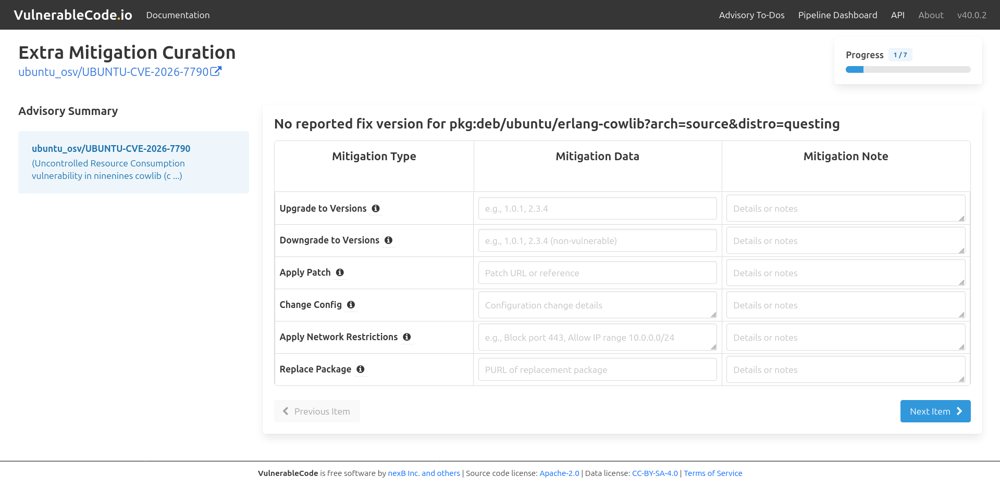

.. _extra-mitigation-curation:

Extra Mitigation Curation
=========================

Extra mitigation curation is currently supported only for vulnerability
advisories with missing fixed packages.

Follow these steps to provide mitigation information for these advisories.

1. Click the alias you want to curate (for example, **UBUNTU-CVE-2026-7790**).

2. Enter the appropriate mitigation types and mitigation data.

   - For each package, provide the mitigation data and
     notes for the following mitigation types:

     - **Upgrade to Versions**: Specify the version(s) users
       should upgrade to in order to remediate the vulnerability.
       Enter one or more fixed versions separated by commas
       (e.g., 1.0.1, 2.3.4). Use the note field for any
       additional upgrade guidance or constraints.

     - **Downgrade to Versions**: Specify the version(s) users
       should downgrade to if no fixed upgrade is available.
       Enter one or more non-vulnerable versions separated
       by commas (e.g., 1.0.1, 2.3.4). Use the note field for
       any additional guidance or cautions related to the downgrade.

     - **Apply Patch**: Provide a URL to the official
       patch or hotfix that remediates the vulnerability.
       Use the note field to include any additional
       instructions, prerequisites, or known limitations.

     - **Change Config**: Provide the configuration changes
       that mitigate the vulnerability, such as modifying
       settings, disabling features, or enabling security controls.
       Use the note field to include any potential side effects
       or additional implementation guidance.

     - **Apply Network Restrictions**: Specify the network
       restrictions required to mitigate the vulnerability,
       such as blocking or limiting access to specific ports,
       IP addresses, or network ranges. Use the note field
       to provide firewall rules, scope details, or additional
       implementation guidance.

     - **Replace Package**: Specify the Package URL of the
       replacement package to use instead of the vulnerable
       package. Use the note field for compatibility
       details or additional guidance.

3. Click **Next item**. If the button is available,
   repeat steps 2–3 for each remaining package in the queue.

   .. image:: images/extra_mitigation_next_item.png

4. After reviewing all mitigated packages,
   click **Submit** to save and complete the mitigation curation.

   .. image:: images/extra_mitigation_submit.png
